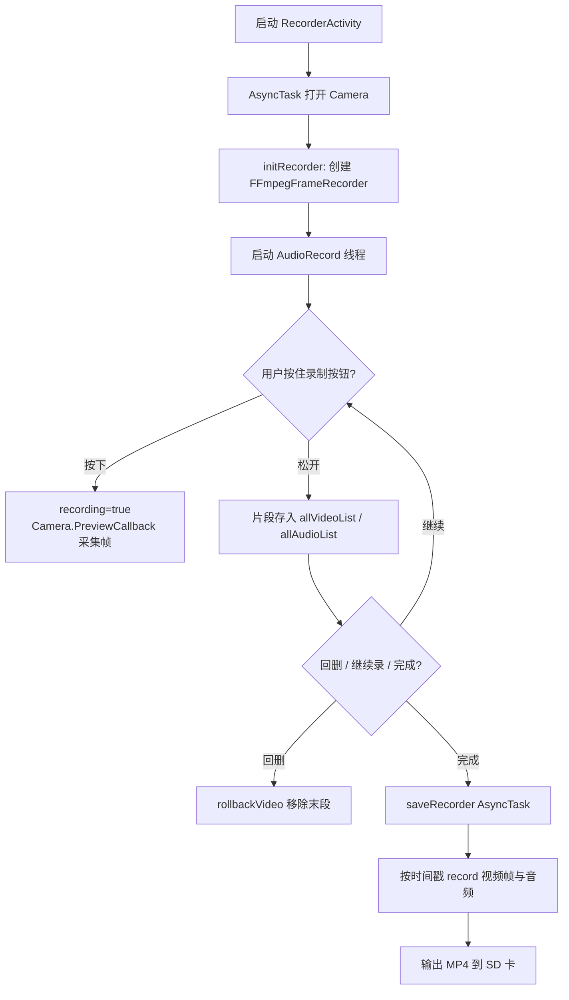

# MediaRecorder — 项目分析

## Layer 0 · 30 秒电梯稿

MediaRecorder 是一款 Android 短视频录制 Demo，面向需要「分段按住录制」交互的场景（类似早期 Vine）。它不依赖系统 `MediaRecorder`，而是自行采集 Camera 预览帧与麦克风 PCM，分段缓存在内存中，录制结束后通过 JavaCV 封装的 FFmpeg 合成为 MP4。技术形态为 Eclipse 时代的单 Activity 工程，基于 Camera1 + AudioRecord + FFmpeg。

## Layer 1 · 5 分钟概览

### 项目定位

本项目演示如何在不使用 Android 系统级 `MediaRecorder` 的情况下，实现分段录制、回删与多片段音视频合成。核心逻辑集中在 `RecorderActivity`，适合学习移动端音视频采集、YUV 处理与 FFmpeg 编码集成。

### 技术栈

| 类别 | 选型 | 证据 |
|------|------|------|
| 语言/运行时 | Java / Android Dalvik | `src/` |
| 框架 | Android SDK（Camera1、AudioRecord、AsyncTask） | `RecorderActivity.java` |
| 多媒体 | JavaCV + FFmpeg + OpenCV | `FFmpegFrameRecorder.java`、`libs/javacv.jar` |
| 存储 | 外部存储 SD 卡目录 | `RecorderEnv.VIDEO_DIR` |
| 构建/部署 | Eclipse ADT + Ant | `.project`、`project.properties` |

### 目录地图

| 目录 | 职责 |
|------|------|
| `src/com/baidu/mediarecorder/` | Activity、自定义 View、业务入口 |
| `src/.../contant/` | 编码与路径常量配置 |
| `src/.../util/` | 相机、YUV、FFmpeg、工具类 |
| `res/layout/` | 录制界面、进度弹窗、预览占位布局 |
| `res/drawable/` | 录制按钮、进度条等 UI 资源 |
| `gen/` | ADT 自动生成的 R 与 BuildConfig |

### 核心模块

- **RecorderActivity**：相机初始化、分段录制状态机、音视频采集、合成导出（`RecorderActivity.java`）
- **ProgressView**：片段进度条绘制、回删高亮、最小时长标记（`ProgressView.java`）
- **FFmpegFrameRecorder**：基于 FFmpeg 的音视频编码器（`util/FFmpegFrameRecorder.java`）
- **RecorderEnv**：帧率、码率、编解码器、时长上下限等全局参数（`contant/RecorderEnv.java`）

### 主流程



## 项目 STAR 描述

> 从**项目视角**叙述；无文档支撑处标 `[待验证]`。

| 维度 | 内容 |
|------|------|
| **S · 背景** | 早期短视频产品普遍采用「按住录、松手停」的分段交互，系统 `MediaRecorder` 难以灵活支持多段拼接、回删与自定义编码参数。需要一套可自主控制采集与合成的录制方案。 |
| **T · 目标** | 实现最长 8 秒、最短 2 秒的分段短视频录制；支持多段拼接、末段回删、进度可视化；输出标准 MP4 文件到外部存储；兼容 API 14+ 设备。 |
| **A · 方案** | 使用 Camera1 预览回调获取 NV21 帧，经 YUV 旋转后转为 `IplImage`；`AudioRecord` 独立线程采集 PCM；每段松手时将帧列表与音频缓冲入队；完成时通过 `FFmpegFrameRecorder` 按时间戳写入 MPEG4 + AAC 并封装为 MP4。 |
| **R · 结果** | 具备完整的分段录制、回删、进度条与 MP4 导出能力；`PreviewActivity` 预览功能尚未完成 `[待补充]`；未见性能与兼容性量化数据 `[待补充]`。 |

### STAR 口述版（1 分钟）

MediaRecorder 面向短视频「按住录制」场景，解决系统 MediaRecorder 无法灵活做多段拼接与回删的问题。项目采用 Camera1 采集预览帧、AudioRecord 采集音频，分段缓存在内存队列中，用户松手即保存一个片段，支持回删上一段。录制结束后，通过 JavaCV 封装的 FFmpeg 按时间戳将多段音视频合成为 MP4，输出到 SD 卡。整体实现了一套从采集、分段管理到软编码导出的完整链路，适合作为移动端 FFmpeg 集成的学习样例。

## 重难点与亮点

### 技术重难点

- **分段音视频同步**：每段独立采集，需在合成时为每帧设置正确时间戳（`frameTime * frameNum`、`audioTimeStamp`），并在暂停期间扣除 `totalPauseTime` 与回删时长 `rollbackTime` → 通过 `VideoFrame.timeStamp` 与 `mediaRecorder.setTimestamp()` 对齐（`RecorderActivity.java`）
- **竖屏相机 YUV 旋转**：Camera 预览默认为横向 NV21，竖屏显示需旋转 90° → `YuvHelper.rotateYUV420Degree90`（`YuvHelper.java`）
- **内存中的分段缓存**：所有片段帧与 PCM 存于 `ArrayList` / `LinkedList`，长录制或高分辨率易触发 OOM → 当前无磁盘落盘中间方案 `[待验证优化方向]`
- **FFmpeg 原生库集成**：JavaCV 依赖 javacpp 与多架构 `.so`，加载失败会导致编码器初始化异常 → `FFmpegFrameRecorder` 静态块中 `Loader.load`（`FFmpegFrameRecorder.java`）
- **机型对焦兼容**：不同设备对焦模式差异大 → 针对 Galaxy S4、魅族 MX3 等硬编码 `FOCUS_MODE_CONTINUOUS_PICTURE` / `CONTINUOUS_VIDEO`（`RecorderActivity.handleSurfaceChanged`）

### 设计亮点

- **自定义进度条状态机**：`ProgressView.State`（START / PAUSE / ROLLBACK / DELETE）驱动不同绘制逻辑，直观展示片段边界与回删态（`ProgressView.java`）
- **采集与编码解耦**：录制阶段只缓存原始帧，完成时统一编码，便于实现回删而不重写文件（`RecorderActivity.saveRecorder`）
- **编码参数集中配置**：`RecorderEnv` 统一管理码率、编解码器、路径，便于切换 H264 / AAC 等参数（`RecorderEnv.java`）
- **相机工具复用**：`CameraHelper` 封装最优预览尺寸选择与屏幕坐标到对焦区域转换（`CameraHelper.java`）

## Layer 2 · 30 分钟深读

### 架构说明

项目为典型的单 Activity 主导型结构，无明确 MVC/MVP 分层：

- **表现层**：`RecorderActivity` + `res/layout` + `ProgressView`
- **业务层**：录制状态机（`recording`、`isRollbackSate`、`allVideoList` 等字段）
- **基础设施层**：`util` 包下的相机、YUV、FFmpeg、日志工具

模块间依赖：`RecorderActivity` → `util/*` + `RecorderEnv` + `ProgressView`；`FFmpegFrameRecorder` 仅依赖 JavaCV 原生接口。

### 关键技术点

| 技术点 | 是什么 | 在哪 | 为何这样设计 |
|--------|--------|------|--------------|
| 分段录制状态机 | 按下/抬起驱动 `recording` 与片段入队 | `RecorderActivity.onTouch` | 模拟 Vine 式交互 |
| 预览帧采集 | `Camera.PreviewCallback.onPreviewFrame` | `RecorderActivity.CameraView` | 绕过 MediaRecorder 获取原始 YUV |
| YUV 旋转 | NV21 顺时针 90° | `YuvHelper.java` | 竖屏预览与编码尺寸对齐 |
| 音频采集线程 | `AudioRecordRunnable` 高优先级循环 read | `RecorderActivity` 内部类 | 与视频并行、仅在 `recording` 时写入 |
| FFmpeg 软编码 | `FFmpegFrameRecorder.record()` | `util/FFmpegFrameRecorder.java` | 统一容器与编解码，支持自定义参数 |
| 进度可视化 | Canvas 绘制片段矩形 + 闪烁指示器 | `ProgressView.onDraw` | 无需第三方 UI 库 |

### 入口与启动顺序

1. `AndroidManifest.xml` 声明 `RecorderActivity` 为 LAUNCHER
2. `onCreate` → `initView` 绑定控件
3. `onResume` → `initCamera`（AsyncTask 打开相机、initRecorder、动态添加 CameraView）
4. `CameraView.surfaceChanged` → `handleSurfaceChanged` + `startPreview`
5. 用户交互驱动录制 / 回删 / 完成

### 数据流

```
Camera NV21 byte[] 
  → YuvHelper.rotateYUV420Degree90 
  → IplImage 
  → VideoFrame(timeStamp, data, iplImage) 
  → tempVideoList 
  → (松手) allVideoList

AudioRecord short[] 
  → ShortBuffer.wrap 
  → tempAudioList 
  → (松手) allAudioList

(完成) allVideoList / allAudioList 
  → FFmpegFrameRecorder.setTimestamp + record() 
  → /sdcard/MediaRecorder/*.mp4
```

### 配置与环境

| 配置 | 位置 | 说明 |
|------|------|------|
| SDK 版本 | `AndroidManifest.xml` | minSdk 14, targetSdk 21 |
| 编译目标 | `project.properties` | android-20 |
| 编码参数 | `RecorderEnv.java` | 帧率、码率、编解码器、时长限制 |
| 输出目录 | `RecorderEnv.VIDEO_DIR` | `/sdcard/MediaRecorder/` |
| 依赖 JAR | `.classpath` | javacv.jar, javacpp.jar |
| 原生库 | `[待验证]` | FFmpeg `.so` 需与 JavaCV 版本匹配 |

### 测试策略

仓库内未见 `test/` 或仪器化测试目录，无自动化测试布局 `[待验证]`。建议真机手动验证：分段录制、回删、8 秒上限、2 秒下限、前后摄切换、对焦、导出 MP4 可播放性。

### 推荐阅读顺序

1. `contant/RecorderEnv.java` — 理解全局参数与约束
2. `RecorderActivity.java` — 核心录制与合成逻辑
3. `ProgressView.java` — 进度条状态与绘制
4. `util/YuvHelper.java` + `util/CameraHelper.java` — 图像与相机处理
5. `util/FFmpegFrameRecorder.java` — 编码底层（篇幅较长，可按需阅读 `start` / `record`）

### 常见坑与扩展点

- **libs 缺失**：`.classpath` 引用 `libs/javacv.jar` 但仓库无 `libs/`，需自行下载 JavaCV Android 包
- **appcompat_v7**：`project.properties` 引用同级 `../appcompat_v7`，单独克隆本仓库可能编译失败
- **现代 Android 适配**：需迁移 Scoped Storage、运行时权限、Camera2/CameraX
- **PreviewActivity**：当前仅为空壳，可扩展为 `VideoView` / `MediaPlayer` 预览
- **性能优化**：可考虑录制过程中落盘临时文件，避免全内存缓存

## Layer 3 · 附录

### 依赖关系简表

```
RecorderActivity
├── ProgressView
├── RecorderEnv
├── CameraHelper
├── YuvHelper
├── VideoFrame
├── FFmpegFrameRecorder → JavaCV (javacv.jar, javacpp.jar, FFmpeg .so)
└── LogHelper

PreviewActivity → [占位，无业务依赖]
RecorderHelper → 工具方法（部分与主流程未完全串联）
```

### 术语表

| 术语 | 含义 |
|------|------|
| 分段录制 | 每次按住到松手构成一个片段，可多段拼接 |
| NV21 | Android Camera 默认 YUV420 预览格式 |
| JavaCV | Java 封装的 OpenCV / FFmpeg 库 |
| 回删 | 删除最近一次已完成的录制片段 |
